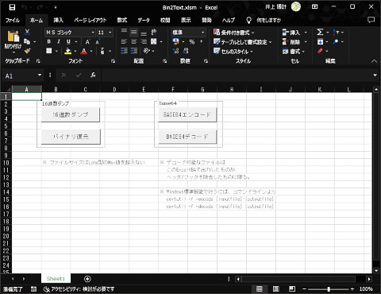

## Binary Dump / Base64 Encode : バイナリダンプ／Base64エンコード for Microsoft Excel<!-- omit in toc -->

[Home](https://oasis3855.github.io/webpage/) > [Software](https://oasis3855.github.io/webpage/software/index.html) > [Software Download](https://oasis3855.github.io/webpage/software/software-download.html) > [office-scripts](../README.md) > ***excel-bin2text*** (this page)

<br />
<br />

Last Updated : Feb. 2023

- [ソフトウエアのダウンロード](#ソフトウエアのダウンロード)
- [概要](#概要)
- [Windows標準機能でBase64エンコード／デコード](#windows標準機能でbase64エンコードデコード)
- [サンプル](#サンプル)
  - [元のファイル](#元のファイル)
  - [バイナリダンプ](#バイナリダンプ)
  - [Base64](#base64)
- [動作確認済み](#動作確認済み)
- [バージョン情報](#バージョン情報)
- [ライセンス](#ライセンス)


<br />
<br />

## ソフトウエアのダウンロード

-    [このGitHubリポジトリを参照する](../excel-bin2text/download/) 

<br />
<br />

## 概要

任意のファイルのバイナリダンプ、Base64エンコードを行うVBAスクリプト。

このスクリプトでは次の処理が可能。

- バイナリダンプ （バイナリ → テキスト）
- バイナリダンプ複合 （テキスト → バイナリ）
- Base64エンコード
- Base64デコード



<br />
<br />

## Windows標準機能でBase64エンコード／デコード

```bash
certutil -f -encode [inputfile] [outputfile]
```

```bash
certutil -f -decode [inputfile] [outputfile]
```

certutilコマンドで作成したBase64エンコードファイルには、ヘッダとフッタの文字列が追加されているため、拙作Bin2Text.xlsmで扱うときは手動でヘッダ・フッタを付加・除去する必要がある。

<br />
<br />

## サンプル

### 元のファイル

```text
小君が姉のところへ行った。空蝉は待っていたようにきびしい小言を言った。
「ほんとうに驚かされてしまった。私は隠れてしまったけれど、だれがどんなことを想像するかもしれないじゃないの。あさはかなことばかりするあなたを、あちらではかえって軽蔑なさらないかと心配する」
　源氏と姉の中に立って、どちらからも受ける小言の多いことを小君は苦しく思いながらことづかった歌を出した。さすがに中をあけて空蝉は読んだ。抜け殻にして源氏に取られた小袿が、見苦しい着古しになっていなかったろうかなどと思いながらもその人の愛が身に沁んだ。空蝉のしている煩悶は複雑だった。
```

### バイナリダンプ

```text
000000 | E5 B0 8F E5 90 9B E3 81 8C E5 A7 89 E3 81 AE E3 
000010 | 81 A8 E3 81 93 E3 82 8D E3 81 B8 E8 A1 8C E3 81 
000020 | A3 E3 81 9F E3 80 82 E7 A9 BA E8 9D 89 E3 81 AF 
000030 | E5 BE 85 E3 81 A3 E3 81 A6 E3 81 84 E3 81 9F E3 
000040 | 82 88 E3 81 86 E3 81 AB E3 81 8D E3 81 B3 E3 81 
000050 | 97 E3 81 84 E5 B0 8F E8 A8 80 E3 82 92 E8 A8 80 
000060 | E3 81 A3 E3 81 9F E3 80 82 0D 0A E3 80 8C E3 81 
000070 | BB E3 82 93 E3 81 A8 E3 81 86 E3 81 AB E9 A9 9A 
000080 | E3 81 8B E3 81 95 E3 82 8C E3 81 A6 E3 81 97 E3 
000090 | 81 BE E3 81 A3 E3 81 9F E3 80 82 E7 A7 81 E3 81 
0000A0 | AF E9 9A A0 E3 82 8C E3 81 A6 E3 81 97 E3 81 BE 

～ 以下省略 ～
```

### Base64

```text
5bCP5ZCb44GM5aeJ44Gu44Go44GT44KN44G46KGM44Gj44Gf44CC56m66J2J44Gv5b6F44Gj
44Gm44GE44Gf44KI44GG44Gr44GN44Gz44GX44GE5bCP6KiA44KS6KiA44Gj44Gf44CCDQrj
gIzjgbvjgpPjgajjgYbjgavpqZrjgYvjgZXjgozjgabjgZfjgb7jgaPjgZ/jgILnp4Hjga/p
mqDjgozjgabjgZfjgb7jgaPjgZ/jgZHjgozjganjgIHjgaDjgozjgYzjganjgpPjgarjgZPj
gajjgpLmg7Plg4/jgZnjgovjgYvjgoLjgZfjgozjgarjgYTjgZjjgoPjgarjgYTjga7jgILj
gYLjgZXjga/jgYvjgarjgZPjgajjgbDjgYvjgorjgZnjgovjgYLjgarjgZ/jgpLjgIHjgYLj
gaHjgonjgafjga/jgYvjgYjjgaPjgabou73olJHjgarjgZXjgonjgarjgYTjgYvjgajlv4Pp

～ 以下省略 ～

```

## 動作確認済み

- Microsoft Excel 2019

## バージョン情報

- Version 1.0 (2023/02/02)
  - 公開開始 

## ライセンス

このワークシート（VBAスクリプト含む）は [GNU General Public License v3ライセンスで公開する](https://www.gnu.org/licenses/gpl-3.0.html) フリーソフトウエア
