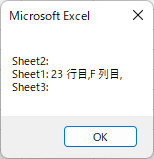

## Excel find hidden line : 非表示の行・列を検索 for Microsoft Excel<!-- omit in toc -->

[Home](https://oasis3855.github.io/webpage/) > [Software](https://oasis3855.github.io/webpage/software/index.html) > [Software Download](https://oasis3855.github.io/webpage/software/software-download.html) > [office-scripts](../README.md) > ***excel-find-hidden-line*** (this page)

 
 

Last Updated : June. 2022

 
 

## ソフトウエアのダウンロード

-    [このGitHubリポジトリを参照する](../excel-find-hidden-line/download/) 

## 概要

Excelワークブック内の全ワークシートから、非表示となっている行・列の一覧を表示する。

## 動作確認済み

- Microsoft Excel 2019

## バージョン情報

- Version 1.0 (2022/06/25)
  - 公開開始 

## ライセンス

このワークシート（VBAスクリプト含む）は [GNU General Public License v3ライセンスで公開する](https://www.gnu.org/licenses/gpl-3.0.html) フリーソフトウエア
