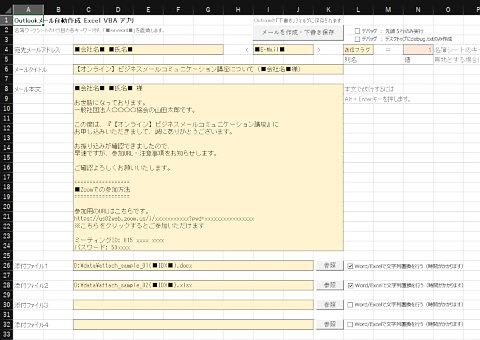

## Outlookメール自動作成・名簿データ差込 for Microsoft Excel<!-- omit in toc -->

[Home](https://oasis3855.github.io/webpage/) > [Software](https://oasis3855.github.io/webpage/software/index.html) > [Software Download](https://oasis3855.github.io/webpage/software/software-download.html) > [office-scripts](../README.md) > ***excel-outlook-mailsend*** (this page)

<br />
<br />

Last Updated : June. 2022

<br />
<br />

## ソフトウエアのダウンロード

-    [このGitHubリポジトリを参照する](../excel-outlook-mailsend/download/) 

## 概要

Excelの名簿データを、外部Excelファイル・Wordファイルに差込保存したファイルを添付したメールを作成するVBAスクリプト

作成したメールはOutlookの下書きフォルダに格納される。なお、下書きフォルダではなく、直接送信する場合はスクリプトの次の部分を変更する

```Basic
' メールをOutlookの「下書き」フォルダに保存する（実際の送信はしない）
'objMail.Send
'objMail.Display
objMail.Save
```

実装している機能は

- メール本文・タイトル中のキーワードの名簿データ置換
- Excel添付ファイル中のキーワードの名簿データ置換
- Word添付ファイル中のキーワードの名簿データ置換
  - プレーンテキスト部
  - 図形テキストボックス内のテキスト部
  - メールリンク文字列
- 名簿データの1行目の各列の文字列が置換キーワードとなる（自由にキーワードを決めることができる）
- Excel, Word添付ファイルの書込制限（パスワード保護）に対応



## 動作確認済み

- Microsoft Excel 2019

## バージョン情報

- Version 1.0 (2022/06/30)
  - 公開開始 

## ライセンス

このワークシート（VBAスクリプト含む）は [GNU General Public License v3ライセンスで公開する](https://www.gnu.org/licenses/gpl-3.0.html) フリーソフトウエア
