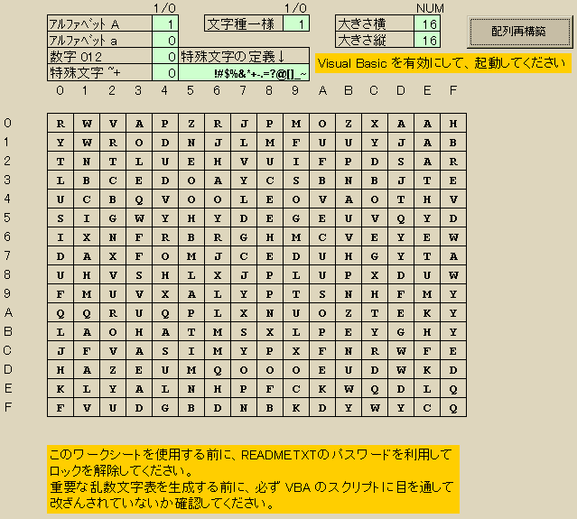

## RndChar 簡易乱数表作成マクロ for Microsoft Excel<!-- omit in toc -->

[Home](https://oasis3855.github.io/webpage/) > [Software](https://oasis3855.github.io/webpage/software/index.html) > [Software Download](https://oasis3855.github.io/webpage/software/software-download.html) > [office-scripts](../README.md) > ***excel-rndchar*** (this page)

 
 

Last Updated : May. 2002

- [ソフトウエアのダウンロード](#ソフトウエアのダウンロード)
- [概要](#概要)
  - [書き込み禁止パスワード](#書き込み禁止パスワード)
  - [簡単な使用法](#簡単な使用法)
- [動作確認済み](#動作確認済み)
- [バージョン情報](#バージョン情報)
- [ライセンス](#ライセンス)

 
 

## ソフトウエアのダウンロード

-    [このGitHubリポジトリを参照する](../excel-rndchar/download/) 

-    [Googleドライブを参照する](https://docs.google.com/open?id=0B7BSijZJ2TAHMzc2MGRlZjUtZDhiNS00NjNkLWEzMmYtZGI2ZTcwMGE4OTFm) 

## 概要

簡易乱数表を作成するExcelワークシートです。より安全なパスワード文字列を作るときの手助けとなるでしょう

本プログラムを使用することで、ランダムな並びの文字列を生成できます。また、ソースコードも含め、処理内容を確認していただくことにより信頼性を高めています。

一般的な「パスワード生成アプリ」との比較すると、このプログラムは乱数文字表を発生しますので、乱数表の中のどの部分文字列を採用するかはユーザが決めることになり、第三者にパスワードが漏洩する可能性がより低くなると考えられます。

利用方法は他にもあるかもしれませんので、ご自由にお使いください。 

### 書き込み禁止パスワード

書き込み禁止設定を解除するパスワードは 「 SAVCAJXF 」 です。

### 簡単な使用法

- 上部の薄緑色の欄が入力欄です。

  「アルファベット A」に 1 をセットすると、大文字のアルファベットを発生します。以下、「アルファベット a」は小文字のアルファベット、「数字 012」は数字を、「特殊文字 ~+」はそのすぐ右の欄に定義されている文字を発生します。

  特殊文字とは、「+」とか「~」とか「$」とかのアルファベットでも数字でもない文字を予定しています。サーバーでこのような文字が入らないパスワードを受け付けないと設定されている場合、この文字を発生させます。

  右上にある「配列再構築」ボタンを押すと、乱数文字列表が作成されます。適当な回数押して表が書き換えられていることを確認してください。

  「特殊文字」のみの乱数文字を発生させるモードで、「特殊文字」に任意の文字列を入力しておくと、その任意の文字列のみでの乱数文字表が作成できます。

- パスワードへの利用

  作成された乱数文字表の任意の場所から任意の長さの文字列を切り出します。

  このソフトウエアが動作しているコンピューターの安全性が確認されていない場合でも、この、「任意の場所から選択する」という「人間の」処理を含むことで、よりパスワードの安全性を高められます。

- 重要なパスワード、通信への応用

  重要なシステムのパスワードを設定する場合は、このプログラムのVBAのソースコードを点検し、不審なコードが埋め込まれていないことを確認ください。

  また、「左上から連続した８文字」等の、単純な文字列の選択は止めたほうが無難です。

- VBA ソースコードのチェック

  「配列再構築」ボタンの主な処理は、０時からの経過秒数をパラメーターとして乱数を初期化します。

  その後、ワークシートからパラメーターを読み込み、rnd 関数で（そんなに精度は良くないが、パスワード程度では十分な…）乱数を発生しています。

## 動作確認済み

- Microsoft Excel 2000/2003

## バージョン情報

- Version 1.0 (2000/09/24)
  - 公開開始 

- Version 1.1 (2002/05/15)
  - 説明書の更新 

## ライセンス

このワークシート（VBAスクリプト含む）は [GNU General Public License v3ライセンスで公開する](https://www.gnu.org/licenses/gpl-3.0.html) フリーソフトウエア
