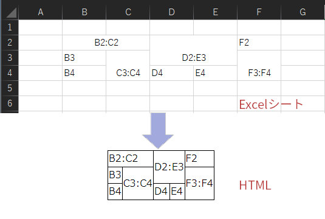

## Excel to Html : ワークシートをHTML tableに変換 for Microsoft Excel<!-- omit in toc -->

[Home](https://oasis3855.github.io/webpage/) > [Software](https://oasis3855.github.io/webpage/software/index.html) > [Software Download](https://oasis3855.github.io/webpage/software/software-download.html) > [office-scripts](../README.md) > ***excel-to-html*** (this page)

<br />
<br />

Last Updated : June. 2022

<br />
<br />

## ソフトウエアのダウンロード

-    [このGitHubリポジトリを参照する](../excel-to-html/download/) 

## 概要

Excelワークシートの表組を、HTMLのtableソースコードに変換するVBAスクリプト

変換元の表組は、開いているワークブックから選択できます。

次の変換イメージ図のように、セル結合した複雑な表組にも対応しています。



変換されたHTMLのソースコードは次のようなものです。

```html
<table>
    <tr>
        <td  colspan = 2>B2:C2</td>
        <td  colspan = 2 rowspan = 2>D2:E3</td>
        <td >F2</td>
    </tr>
    <tr>
        <td >B3</td>
        <td  rowspan = 2>C3:C4</td>
        <!-- rowspan -->
        <td  rowspan = 2>F3:F4</td>
    </tr>
    <tr>
        <td >B4</td>
        <!-- rowspan -->
        <td >D4</td>
        <td >E4</td>
        <!-- rowspan -->
    </tr>
</table>
```

## 動作確認済み

- Microsoft Excel 2019

## バージョン情報

- Version 1.0 (2022/06/25)
  - 公開開始 

## ライセンス

このワークシート（VBAスクリプト含む）は [GNU General Public License v3ライセンスで公開する](https://www.gnu.org/licenses/gpl-3.0.html) フリーソフトウエア
