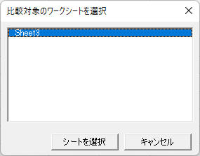
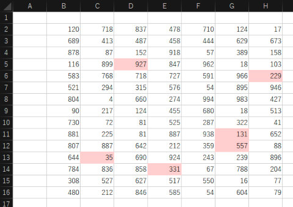

## Worksheet Compare : ワークシート比較 for Microsoft Excel<!-- omit in toc -->

[Home](https://oasis3855.github.io/webpage/) > [Software](https://oasis3855.github.io/webpage/software/index.html) > [Software Download](https://oasis3855.github.io/webpage/software/software-download.html) > [office-scripts](../README.md) > ***excel-worksheet-compare*** (this page)

 
 

Last Updated : June. 2022

 
 

## ソフトウエアのダウンロード

-    [このGitHubリポジトリを参照する](../excel-worksheet-compare/download/) 

## 概要

2つのExcelワークシート間で差異のあるセルを着色するVBAスクリプト

比較対象とするワークブックは、「ファイルを開く」ダイアログで任意のファイルを指定可能。また、指定したワークブック内で、次のような選択ダイアログで任意のワークシートを指定可能。

比較した結果は新しいワークブックに書き込まれ、次のように差異のある部分に着色が行われる

## 動作確認済み

- Microsoft Excel 2019

## バージョン情報

- Version 1.0 (2022/06/25)
  - 公開開始 

## ライセンス

このワークシート（VBAスクリプト含む）は [GNU General Public License v3ライセンスで公開する](https://www.gnu.org/licenses/gpl-3.0.html) フリーソフトウエア
