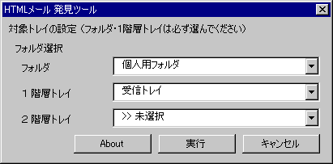

## Outlook HTMLメール発見ツール for Microsoft Outlook<!-- omit in toc -->

[Home](https://oasis3855.github.io/webpage/) > [Software](https://oasis3855.github.io/webpage/software/index.html) > [Software Download](https://oasis3855.github.io/webpage/software/software-download.html) > [office-scripts](../README.md) > ***outlook-htmlmail-find*** (this page)

 
 

Last Updated : May. 2003

- [ソフトウエアのダウンロード](#ソフトウエアのダウンロード)
- [概要](#概要)
  - [インストール方法](#インストール方法)
  - [ソフトウエアの起動方法](#ソフトウエアの起動方法)
- [動作確認済み](#動作確認済み)
- [バージョン情報](#バージョン情報)
- [主な掲載雑誌](#主な掲載雑誌)
- [ライセンス](#ライセンス)

 
 

## ソフトウエアのダウンロード

-    [このGitHubリポジトリを参照する](../outlook-htmlmail-find/download_arc/) 

-    [Google Driveを参照する](https://drive.google.com/drive/folders/0B7BSijZJ2TAHNTM0ZjQ3ZGMtMWNlYi00OTEyLWIyZWItOGI5MDRhNDVjMjAz?resourcekey=0-9H_UDX8iDmU9j1-i0lfzwA)

 
 

## 概要

重大なセキュリティリスクの根源であるHTMLメールの取り扱いを避けるため、Outlookに配信されメールからHTML形式のものを探し出すツールです

 検索対象トレイの選択ダイアログ

選択したトレイに存在するHTMLメールの一覧を表示することができます。

 
 

### インストール方法

1. 開発メニュー（リボン）を表示（「開発」メニューがない場合は、Outlookのメニューバーを右クリックして「リボンのユーザ設定」より「開発」メニューを有効化）
2. 「開発」メニューの左端、VBE（Visual Basic Editor）を表示
3. VBEのプロジェクト エクスプローラで、配布ファイル（DlgFindHtml.frm と ModuleFindHtmlOpenDlg.bas，ModuleCommon.bas）をインポート
4. VBEの「ツール」メニューより「参照設定」を開き、Microsoft Scripting Runtime を有効化

### ソフトウエアの起動方法

1. 「開発」メニューの「マクロ」よりVBAスクリプトを起動

 
 

## 動作確認済み

- Microsoft Outlook 2000/2002/2003

 
 

## バージョン情報

- Version 1.0 (2001/09/23)

   - 公開用初版 

- Version 1.1 (2001/09/27)

   - HTMLメールをテキストファイルに追加する機能を追加 
   - ヘルプファイル添付 

- Version 1.2 (2003/05/08)

   - ファイルを保存するコモンダイアログの追加 

 
 

## 主な掲載雑誌

-    インターネットスタート・ウインドウズＲｏｍ！（毎日コミュニケーションズ） 
-    ウインドウズ・パワー（アスキー） 

 
 

## ライセンス

このスクリプトは [GNU General Public License v3ライセンスで公開する](https://www.gnu.org/licenses/gpl-3.0.html) フリーソフトウエア

