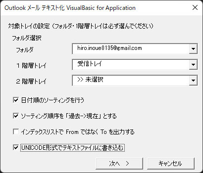

## Outlookメール テキスト化ツール for Microsoft Outlook<!-- omit in toc -->

[Home](https://oasis3855.github.io/webpage/) > [Software](https://oasis3855.github.io/webpage/software/index.html) > [Software Download](https://oasis3855.github.io/webpage/software/software-download.html) > [office-scripts](../README.md) > ***outlook-mail-export*** (this page)

 
 

Last Updated : July. 2022

 
 

## ソフトウエアのダウンロード

-    [このGitHubリポジトリを参照する](../outlook-mail-export/download/) 

-    [Google Driveを参照する](https://drive.google.com/drive/folders/0B7BSijZJ2TAHNTM0ZjQ3ZGMtMWNlYi00OTEyLWIyZWItOGI5MDRhNDVjMjAz?resourcekey=0-9H_UDX8iDmU9j1-i0lfzwA)

## 概要

Outlookに配信されるメールを一括してテキストファイルにエクスポートするツール。

任意のアカウント、フォルダを対象として指定可能。

### インストール方法

1. 開発メニュー（リボン）を表示（「開発」メニューがない場合は、Outlookのメニューバーを右クリックして「リボンのユーザ設定」より「開発」メニューを有効化）
2. 「開発」メニューの左端、VBE（Visual Basic Editor）を表示
3. VBEのプロジェクト エクスプローラで、配布ファイル（DlgTxtoutMain.frm と ModuleTxtoutOpenDlg.bas）をインポート
4. VBEの「ツール」メニューより「参照設定」を開き、Microsoft Scripting Runtime を有効化

### ソフトウエアの起動方法

1. 「開発」メニューの「マクロ」よりVBAスクリプトを起動

## 動作確認済み

- Microsoft Outlook 2019

## バージョン情報

- Version 1.0 (2001/03/31)

    - 公開用初版 

- Version 1.1 (2003/03/08)

    - ファイルを保存するコモンダイアログの追加 
    - メールのインデックスを書き込む仕様の追加 

- Version 1.2 (2005/11/19)

    - ※ 濱田氏の協力による実装 
    - UNICODE形式での保存を追加 
    - 行末記号が 0x0d 0x0a 0x0a のときのエラーに対応 

- Version 1.3 (2022/07/05)

    - Outlook2019対応(ファイル コモンダイアログ部分を削除)
    - MailItem, ReportItem, AppointmentItem, MeetingItem に対応

## 主な掲載雑誌

-    インターネットスタート・ウインドウズＲｏｍ！（毎日コミュニケーションズ） 
-    ウインドウズ・パワー（アスキー） 

## ライセンス

このワークシート（VBAスクリプト含む）は [GNU General Public License v3ライセンスで公開する](https://www.gnu.org/licenses/gpl-3.0.html) フリーソフトウエア
